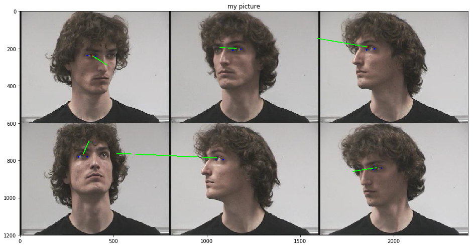

# Eye Gaze Estimator

##### A program using Fabian Timm algorithm and PNP projection to estimate gaze position
|Host|link|
|---|---|
| Github | [:link:](https://github.com/BenjaminPoilve/Eye-Gaze-Estimator/blob/master/Main.ipynb)   |
|  NBviewer |  [:link:](https://nbviewer.jupyter.org/github/BenjaminPoilve/Eye-Gaze-Estimator/blob/master/Main.ipynb) |

The goal of this project was to estimate where the eye gaze of the user was positionned in space

Here is the result:

#### How to use

This is a python notebook, so you can easily launch it on your computer.

#### How it works

It's pretty straightforward.

* Use Dlib facial landmark detection for face position and eye extraction
* Use [Fabian Timm methods](https://www.researchgate.net/publication/221415814_Accurate_Eye_Centre_Localisation_by_Means_of_Gradients) to find pupils.
* Find eye rotation matrix (using pupils and eye corners) and face rotation matrix (from facial landmarks) using PNP solving (see [here](https://www.morethantechnical.com/2010/03/19/quick-and-easy-head-pose-estimation-with-opencv-w-code/))
* Draw the gaze vector on screen

Of course for a precise application you need to calibrate your camera parameter and surface position, but the gist of it is here! 
